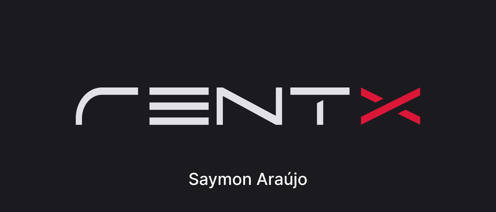
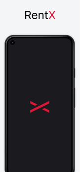
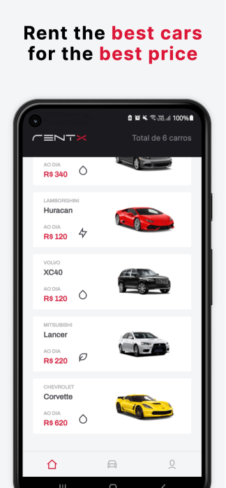
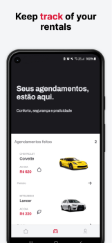
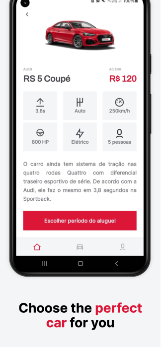
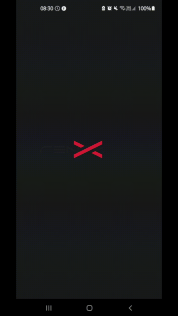

<h1 align="center">
    
</h1>

<h3 align="center">Luxury Car Rental App Project</h3>

<p align="center">
  
</p>

<p align="center">
 <a href="#description">Description</a> • 
 <a href="#technical-details">Technical details</a> •
 <a href="#features">Features</a> • 
 <a href="#how-to-use">How to use</a> • 
 <a href="#license">License</a>
</p>

<br>
<br>

# Description
<p>This project is about an app for bussiness that rent luxury cars, it allows the user to view cars provided by the company and rent them for a period of time. This project was developed during my bootcamp at Rocketseat.</p>


<div align="center">
 &nbsp;&nbsp;&nbsp;&nbsp;
 &nbsp;&nbsp;&nbsp;&nbsp;
 &nbsp;&nbsp;&nbsp;&nbsp;
 &nbsp;&nbsp;&nbsp;&nbsp;
</div>


<br>

# Technical details
<p>The project was developed using React Native, so it works on Android and IOS. It is an app designed to be Offiline First, and during the creation expo modules were used to speed up the development.</p>

### Some of the concepts that were worked on during the project development are:

- Custom hooks and useContext
- Offline First implementation with WatermelonDB
- Animations with Reanimated
- Lottie animations implementation
- Advanced features with calendars

<br>

# Features

- [x] Sign up and Sign in
- [x] View information about the available cars
- [x] Schedule a period to rent the car
- [x] View my rented cars
- [x] Change user information and password

<p align="center">
  
</p>

<br>


# How to use

To run the project, you will need to have the [React Native CLI enviroment](https://reactnative.dev/docs/environment-setup) configured and [Yarn](https://classic.yarnpkg.com/en/docs/getting-started) installed. After this follow this instructions:

```bash
# Clone this repository to your local machine
$ git clone https://github.com/saymon-araujo/rentx

# Navigate to the server
$ cd rentx/backend/rentx-api/ 

# Install the server dependencies
$ yarn

# Start the server and leave it running
$ yarn start

# On another terminal navigate to the mobile folder
$ cd rentx/mobile/rentx/

# Install the dependencies
$ yarn
$ expo install

# Run the app
$ yarn android

# Login
 Email: saymonbrandon@gmail.com
 Password: 123
```

<br>
<br>

# License

This project is under MIT license . [See it](https://github.com/saymon-araujo/rentx/blob/master/LICENSE) for more information.

---

Made by Saymon Araújo
<div>
 <p> Feel free to get in touch, it will be a pleasure to chat.</p>
  <a href="https://www.linkedin.com/in/saymon-araujo/" target="_blank"></a>
  <a href="mailto:saymonbrandon@gmail.com?subject=Hello%20Saymon,%20From%20Github"></a>
  <a href="https://t.me/saymon_araujo_dev"></a>&nbsp;&nbsp;&nbsp;&nbsp;
</div>
